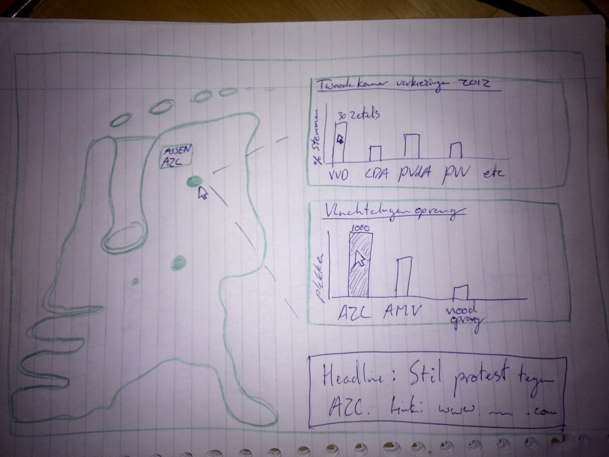

Eindproject Minor Programmeren door Job Huisman
========================================================================================================
Project over azc en politieke voorkeur per gemeente.
--------------------------------------------------------------------------------------------------------

### Problem definition

> Het publiek krijgt in het debat omtrent de vluchtelingencrisis veel nieuws te horen. Veel krantenkoppen geven
> in het debat rond de vluchtelingencrisis de voorkeur aan negatief nieuws. Schandalen verkopen nou eenmaal beter
> dan positieve verhalen, welke niet de allure hebben van een groot schandaal in de vorm van een succes. 
> Vooral de berichtgeving rond protesten tegen een azc krijgen veel aandacht. Politici die voorstander van deze 
> protesten zijn, grijpen dan ook maar al te graag de kans om met deze protesten aan de haal te gaan. Echter blijven 
> daarbij de minder grofgebekte goedwillende burgers achter.
> Daarom schreeuwt de data rond de aanpak van de vluchtelingenopvang om een visualisatie die duidelijk maakt hoe het nou
> echt gesteld is met de vluchtelingenopvang in Nederland. 
> Het publiek heeft namelijk recht op een eerlijke weergave van de situatie. Het is daarom goed een visualisatie te maken
> waarin duidelijk is waar er problemen en protesten tegen een azc zijn geweest, wat daar de politieke voorkeur is en hoe 
> groot de verandering in die gemeente nou feitelijk is. Daarmee hoop ik een antwoord te kunnen geven op de vraag:
> Zijn gemeenten waar veel extreem rechts wordt gestemd vooral tegen azc's of is er geen scheen dat die link gemaakt kan 
> worden? IS het terecht of onterecht dat extreem rechtse politieke partijen aanhalen naar hun achterban of komt een 
> dergelijk protest hen alleen goed uit? Met andere woorden, is het een cliche/verwacht verhaal of dient er een andere 
> conclusie getrokken te worden?
>
> Om dit probleem te verhelpen dient er een visualisatie te komen van de data omtrent de plannen van het bouwen van een azc
> of noodopvang. Daarin dient duidelijk weergegeven te worden hoeveel plekken er nog moeten komen en er al zijn(barchart)(MVP). 
> Daarnaast dient de politieke voorkeur van de gemeente in kaart te worden gebracht. Dit zal ook in een 
> barchart komen(MVP). Deze barchart worden bediend door op een interactieve map(MVP) van Nederland. Daarin is het mogelijk
> om te kunnen klikken op gemeenten. Iedere gemeente wordt weergegeven met een stip. De grootte van de stip hangt af van de 
> grootte van de vluchtelingenopvang/asielopvang(MVP). 
> Wanneer er een conflict of protest tegen een azc is geweest dan wordt dat vermeld. Daarbij is er een link zichtbaar naar het 
> artikel omtrent dit conflicht(MVP).
>
> ## Visualisaties(MVP):
> - Interactive map met grootte van stippen naar opvanggrootte
> - Barchart met politieke voorkeur
> - Barchart met asielopvangaantallen
> 
> ## Interactie(MVP):
> - Interactieve map is verbonden met barcharts (onclick)
> - hoover over gemeenten toont conflict ja of nee (hoover)
> - hoover binnen charts toont aantallen op de as
> 
> ## Mogelijke extra features/interactie:
> - Data naar inwoneraantal (mogelijkheid om gemeenten te filteren naar inwoneraantal)
> - Tegenover de protesten ook weergeven van het aantal vrijwilligers per gemeente
> 
> ## Technical problems/limitations:	
> 
> - Data is vaak niet scrapebaar door dropdownmenus (handwerk al wel grotendeels gedaan)
> - Beschikbaarheid interactive map van alle gemeenten.
> 
> ## De databronnen:
> 
> - huidige opvang:	Centraal Orgaan Asielzoekers
> - geplande opvang:	https://localfocus2.appspot.com/5613cc9583d28
> - politieke voorkeur:	http://www.verkiezingskaart.nl/#
> - conflicten:		ANP/Nieuwsberichten
>
> ## Schets:
> 
> Zie 
